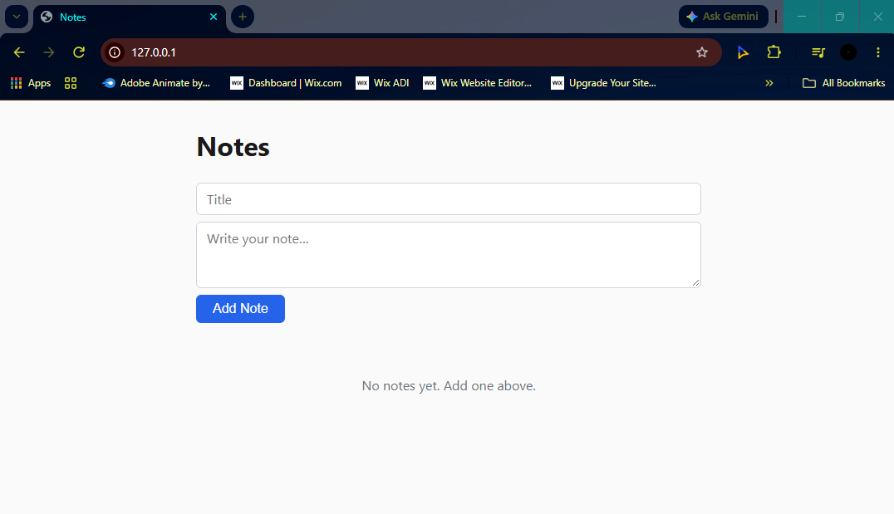
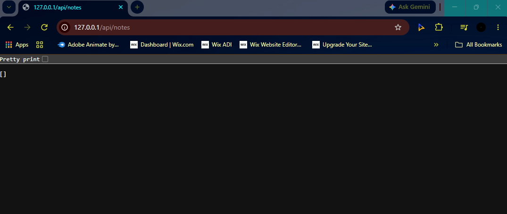
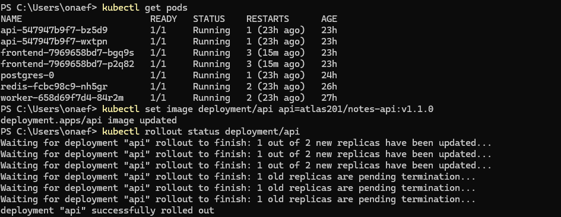
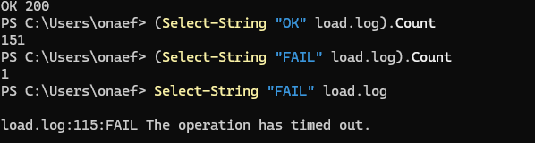
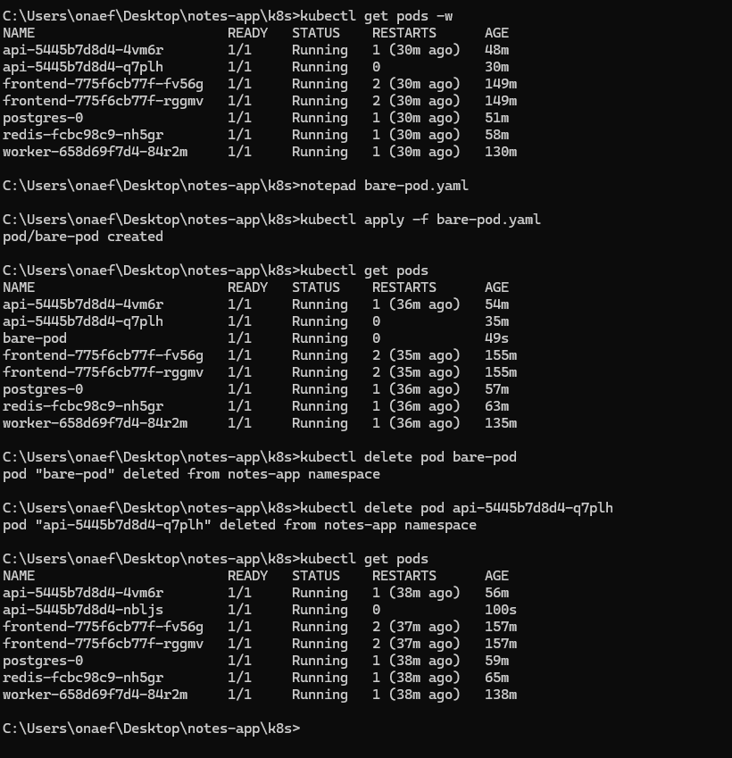
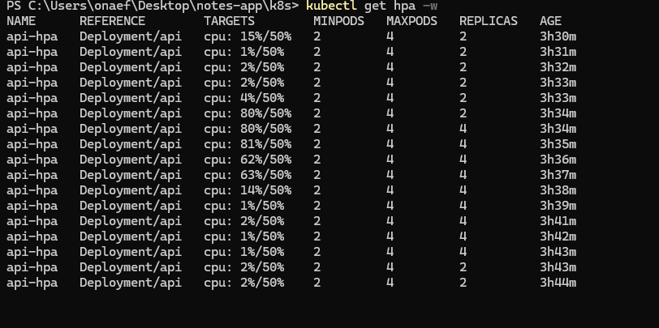
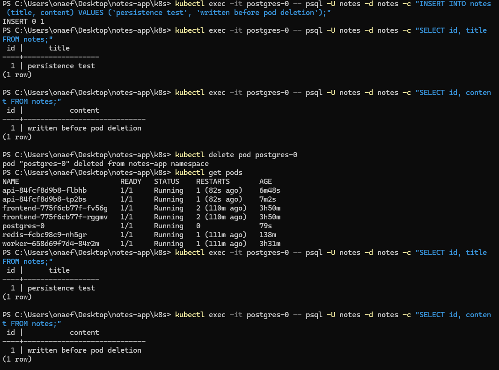

# Notes App on Kubernetes: Resilient Deployment

A notes application made of five containerised services, deployed to a single-node minikube cluster in the `notes-app` namespace.

- **frontend** serves the static web app through Nginx and proxies `/api` requests to the API.
- **api** reads and writes notes in Postgres and publishes an event to Redis on every change.
- **worker** subscribes to that Redis channel and keeps a running event count in Redis.
- **postgres** stores the notes on a persistent volume.
- **redis** acts as the cache and as the publish/subscribe broker between the API and the worker.

The deployment demonstrates zero-downtime rolling updates, CPU-based auto-scaling, self-healing, persistent storage, and tier-by-tier network policies.

> Docker build, image scanning and CI documentation: [docs/README.md](docs/README.md)

## Architecture

### Diagram

```text
                     Browser
                        |
                 minikube tunnel
                        |
       Ingress controller (ingress-nginx)
             |                     |
             /                   /api
             |                     |
+------------|---------------------|---------------------+
|            v                     v                     |
|    frontend Svc :8080      api Svc :3000               |
|            |                     |                     |
|            v                     v                     |
|       frontend x2 ----------> api x2-4  (HPA, PDB)     |
|         (Nginx)   proxy /api  |      |                 |
|                               |      |                 |
|                               v      v                 |
|   worker x1 -----------> redis :6379 postgres :5432    |
|                               |            |           |
|                               v            v           |
|                           redis x1     postgres-0      |
|                       (no persistence) (StatefulSet)   |
|                                            |           |
|                                            v           |
|                                      PVC data 1Gi      |
|                                                        |
+---------------- namespace: notes-app ------------------+
```

Arrows point from the client to the server, which is the same direction the NetworkPolicies filter on.

### Components

| Component        | Kind        | Replicas  | Image:tag                        | Port | Notes                                                                          |
| ---------------- | ----------- | --------- | -------------------------------- | ---- | ------------------------------------------------------------------------------ |
| frontend         | Deployment  | 2         | `atlas201/notes-frontend:v1.0.1` | 8080 | Nginx, serves static files, proxies `/api` to the api Service. Runs as UID 101 |
| api              | Deployment  | 2-4 (HPA) | `atlas201/notes-api:v1.0.0`      | 3000 | Init container waits for Postgres. Runs as UID 1001                            |
| worker           | Deployment  | 1         | `atlas201/notes-worker:v1.0.0`   | 3001 | Subscribes to Redis. No Service, nothing calls it. Runs as UID 1001            |
| postgres         | StatefulSet | 1         | `postgres:16-alpine3.24`         | 5432 | 1Gi PVC, schema loaded from the `init-sql` ConfigMap                           |
| redis            | Deployment  | 1         | `redis:8-alpine3.22`             | 6379 | Cache and pub/sub broker, no persistence                                       |
| note-app-ingress | Ingress     | N/A       | ingress-nginx                    | 80   | `/` to frontend, `/api` to api                                                 |
| app-config       | ConfigMap   | N/A       | N/A                              | N/A  | Postgres and Redis host and port                                               |
| init-sql         | ConfigMap   | N/A       | N/A                              | N/A  | `init.sql` that creates the `notes` table                                      |
| app-secret       | Secret      | N/A       | N/A                              | N/A  | Postgres user, password and database name                                      |

### Traffic flow

The browser reaches the ingress-nginx controller through `minikube tunnel`. The Ingress sends `/api` requests to the `api` ClusterIP Service on port 3000, which returns JSON, and sends everything else to the `frontend` ClusterIP Service on port 8080, which returns the web app. The frontend's Nginx also proxies `/api` calls to the API by its Service name. Only the frontend and the API are reachable from outside the cluster, and only through the Ingress. Postgres, Redis and the worker are internal.

## Repository Structure

```text
notes-app/
├── .github/workflows/
│   └── docker-publish.yml              # CI: build, scan, push images to Docker Hub
├── docker/                             # Docker Compose (local dev and prod)
│   ├── docker-compose.yml
│   ├── docker-compose.override.yml
│   ├── docker-compose.prod.yml
│   └── .env.example
├── docs/
│   └── README.md                       # Docker project documentation
├── images-docker/                      # Docker project evidence (Trivy, CI)
├── images-k8s/                         # Kubernetes resilience test evidence
├── k8s/
│   ├── namespace/
│   │   └── namespace.yaml              # notes-app namespace
│   ├── config/
│   │   ├── configmap.yaml              # App settings (hosts and ports)
│   │   ├── init-sql-configmap.yaml     # DB schema for Postgres init
│   │   └── secret.example.yaml         # Credential template (real secret.yaml is gitignored)
│   ├── data/
│   │   ├── statefulset.yaml            # Postgres + PVC
│   │   ├── postgres-headless-service.yaml  # StatefulSet DNS
│   │   ├── postgres-clusterip-service.yaml # Client access to Postgres
│   │   ├── deployment-redis.yaml       # Redis
│   │   └── redis-service.yaml          # Client access to Redis
│   ├── app/
│   │   ├── deployment-api.yaml         # API (init container, anti-affinity)
│   │   ├── api-service.yaml
│   │   ├── deployment-worker.yaml      # Background worker
│   │   ├── deployment-frontend.yaml    # Frontend (Nginx)
│   │   └── frontend-service.yaml
│   ├── ingress/
│   │   └── ingress.yaml                # / to frontend, /api to api
│   ├── scaling/
│   │   └── hpa.yaml                    # API autoscaler, CPU 50%, 2-4 replicas
│   ├── pdb/
│   │   └── pdb.yaml                    # API minAvailable 1
│   └── security/
│       ├── networkpolicy-frontend-ingress.yaml
│       ├── networkpolicy-api-ingress.yaml
│       ├── networkpolicy-postgres-ingress.yaml
│       ├── networkpolicy-redis-ingress.yaml
│       └── networkpolicy-dns-egress.yaml
├── services/
│   ├── api/                            # Node.js API
│   ├── worker/                         # Node.js worker
│   ├── frontend/                       # Vite + Nginx
│   └── database/init.sql               # Schema (used by Compose)
├── .gitignore
└── README.md                           # Kubernetes project documentation
```

## Requirements Compliance

| Requirement                                      | How it's met                                                                                                                              | File                                                                                                |
| ------------------------------------------------ | ----------------------------------------------------------------------------------------------------------------------------------------- | --------------------------------------------------------------------------------------------------- |
| Frontend, 2+ replicas, Deployment                | `replicas: 2`                                                                                                                             | `k8s/app/deployment-frontend.yaml`                                                                  |
| Backend API, 2+ replicas, Deployment             | The Deployment has no `replicas` field. The HPA owns the replica count with `minReplicas: 2`                                              | `k8s/app/deployment-api.yaml`, `k8s/scaling/hpa.yaml`                                               |
| Database, StatefulSet with PVC                   | Postgres StatefulSet with a 1Gi `volumeClaimTemplate`, giving a stable Pod name (`postgres-0`) and stable storage                         | `k8s/data/statefulset.yaml`                                                                         |
| Cache layer                                      | Redis Deployment and ClusterIP Service                                                                                                    | `k8s/data/deployment-redis.yaml`                                                                    |
| Rolling update, `maxSurge=1`, `maxUnavailable=0` | Set in the `strategy` block of each application Deployment, so a new Pod must be ready before an old one is removed                       | `k8s/app/deployment-api.yaml`, `k8s/app/deployment-worker.yaml`, `k8s/app/deployment-frontend.yaml` |
| Liveness and readiness probes                    | Set on every container, with tuned `timeoutSeconds`, `initialDelaySeconds`, `periodSeconds` and `failureThreshold` (see Design Decisions) | All files in `k8s/app/`, `k8s/data/deployment-redis.yaml`, `k8s/data/statefulset.yaml`              |
| Resource requests and limits                     | Set on every container, including the init container                                                                                      | All files in `k8s/app/`, `k8s/data/deployment-redis.yaml`, `k8s/data/statefulset.yaml`              |
| PodDisruptionBudget                              | `minAvailable: 1` on the API, so voluntary disruptions such as a node drain cannot take every API Pod down at once                        | `k8s/pdb/pdb.yaml`                                                                                  |
| HPA on the API (CPU)                             | `autoscaling/v2`, min 2, max 4, target 50% average CPU                                                                                    | `k8s/scaling/hpa.yaml`                                                                              |
| All configuration in ConfigMaps                  | Postgres and Redis hosts and ports in `app-config`, DB schema in `init-sql`                                                               | `k8s/config/configmap.yaml`, `k8s/config/init-sql-configmap.yaml`                                   |
| All secrets in Secrets                           | Postgres user, password and database name in `app-secret`. The real file is gitignored and a template is committed                        | `k8s/config/secret.example.yaml`                                                                    |
| NetworkPolicy between tiers                      | One ingress policy per tier plus a DNS egress policy                                                                                      | All files in `k8s/security/`                                                                        |
| Non-root containers where possible               | `runAsNonRoot: true` with `runAsUser` 1001 (api, worker) and 101 (frontend)                                                               | All files in `k8s/app/`                                                                             |
| Namespace isolation                              | Every resource lives in `notes-app`                                                                                                       | `k8s/namespace/namespace.yaml`                                                                      |
| ClusterIP Services                               | One per component that is called by another, plus a headless Service for the StatefulSet                                                  | `k8s/app/*-service.yaml`, `k8s/data/*-service.yaml`                                                 |
| Ingress with path routing                        | `/` to frontend:8080, `/api` to api:3000, `pathType: Prefix`, no rewrite                                                                  | `k8s/ingress/ingress.yaml`                                                                          |

## Deployment Instructions

### Prerequisites

- Docker
- minikube (tested with Kubernetes v1.35.1, Docker driver)
- kubectl
- At least 3 GB RAM and 2 CPUs free for the minikube node

### Steps

1. Start the cluster and enable the addons:

   ```bash
   minikube start --driver=docker --memory=3072 --cpus=2
   minikube addons enable ingress
   minikube addons enable metrics-server
   ```

2. Clone the repo:

   ```bash
   git clone https://github.com/Jason2303/notes-app.git
   cd notes-app
   ```

3. Create the Secret file from the template and set a password:

   ```bash
   cp k8s/config/secret.example.yaml k8s/config/secret.yaml
   nano k8s/config/secret.yaml    # replace the placeholder POSTGRES_PASSWORD
   ```

4. Apply the manifests in dependency order. The namespace must exist first, and config must exist before the Pods that read it:

   ```bash
   kubectl apply -f k8s/namespace/
   kubectl apply -f k8s/config/configmap.yaml -f k8s/config/init-sql-configmap.yaml -f k8s/config/secret.yaml
   kubectl apply -f k8s/data/
   kubectl apply -f k8s/app/
   kubectl apply -f k8s/ingress/ -f k8s/scaling/ -f k8s/pdb/ -f k8s/security/
   ```

   The config files are applied by name so the template is never applied over the real Secret.

5. Set `notes-app` as the default namespace for the rest of the commands:

   ```bash
   kubectl config set-context --current --namespace=notes-app
   ```

6. In a separate terminal, start the tunnel and leave it running:

   ```bash
   minikube tunnel
   ```

   On Windows this must run in an Administrator terminal, or it exits immediately.

### Verify

```bash
kubectl get pods
```

A healthy deployment shows 7 Pods, all `Running` and `1/1`: 2 api, 2 frontend, 1 worker, 1 redis and `postgres-0`. Image pulls on a fresh cluster can keep Pods in `ContainerCreating` for a few minutes, and api Pods show `Init:0/1` until Postgres is ready.

```bash
kubectl get hpa
kubectl get pvc
curl http://127.0.0.1/api/notes
```

Then open `http://127.0.0.1/` in a browser to load the app.




## Security

**NetworkPolicies.**

| Policy                   | Protects       | Allows ingress from                                             |
| ------------------------ | -------------- | --------------------------------------------------------------- |
| `frontend-networkpolicy` | frontend :8080 | ingress-nginx namespace                                         |
| `api-networkpolicy`      | api :3000      | frontend Pods, ingress-nginx namespace                          |
| `postgres-networkpolicy` | postgres :5432 | api Pods                                                        |
| `redis-networkpolicy`    | redis :6379    | api Pods, worker Pods                                           |
| `dns-egress`             | all Pods       | Egress to CoreDNS (UDP and TCP 53) and to Pods in the namespace |

Note: these policies are not enforced on this cluster. See Known Limitations.

**Secrets.** Postgres credentials live in a Kubernetes Secret, not in the manifests or the images. The real `secret.yaml` is gitignored and only a template is committed. Secret values are base64-encoded, not encrypted, and minikube does not enable encryption at rest in etcd. In production they would come from an external secret store.

**Non-root.** The api, worker and frontend containers set `runAsNonRoot: true` with a fixed non-root UID. Postgres and Redis run as their official images' defaults: their entrypoints start as root to set ownership on the data directory, then drop to the `postgres` and `redis` users.

**Resource limits.** Every container has CPU and memory requests and limits, so one misbehaving Pod cannot starve the node.

**Namespace isolation.** All resources live in `notes-app`, separate from system components and anything else on the cluster.

## Design Decisions

- **Probe timeouts raised above the 1 second default.** On the constrained node, healthy containers took longer than 1 second to answer under load, so probes failed and Kubernetes restarted healthy Pods (Postgres reached 9 restarts, Redis 11). The restarts raised CPU, the HPA added more Pods, and the node starved further. Timeouts were raised to 5s for the HTTP probes and Redis, and 10s for the Postgres `exec` probe. Restarts dropped to zero.
- **The api Deployment has no `replicas` field.** The HPA owns the replica count. Setting both would make every `kubectl apply` reset the count and fight the autoscaler.
- **The worker is not autoscaled.** Its CPU usage doesn't reflect how much work is queued.
- **Redis has no persistence.** It holds a demo counter and pub/sub messages, non-critical data.
- **Anti-affinity is `preferred`, not `required`.** On one node, `required` would leave every replica after the first stuck in `Pending`. `preferred` spreads replicas when more nodes exist and still schedules them on one node.
- **Init container on the api.** The API already retries its database connection, but the init container makes the wait visible as `Init:0/1` in `kubectl get pods` instead of hiding it in application logs.
- **StatefulSet with a headless Service for Postgres.** This gives the database a stable name (`postgres-0`) and a PVC that is reattached to the same Pod after it is recreated.
- **Single Postgres replica.** Replication needs a second database Pod and more memory than the 3 GB node has. One replica with a PVC meets the persistence requirement.

## Resilience Test Results

The tests were run in PowerShell on Windows; the bash equivalent is shown below.

### 1. Zero-downtime deploy

A load loop sent a request to `/api/notes` through the Ingress every 200 ms while the api image was changed. Every response was logged as `OK` or `FAIL`. The tag `v1.1.0` is a local retag of `v1.0.0` loaded into minikube, used only to give the rollout a different image to roll to.

```bash
# one-time setup: create the second tag inside minikube
docker tag atlas201/notes-api:v1.0.0 atlas201/notes-api:v1.1.0
minikube image load atlas201/notes-api:v1.1.0

# terminal 1: load loop
rm -f load.log
while true; do
  code=$(curl -s -o /dev/null -w "%{http_code}" --max-time 5 http://127.0.0.1/api/notes)
  if [ "$code" = "200" ]; then line="OK $code"; else line="FAIL $code"; fi
  echo "$line" | tee -a load.log
  sleep 0.2
done

# terminal 2: roll out the new image and wait for it to finish
kubectl set image deployment/api api=atlas201/notes-api:v1.1.0
kubectl rollout status deployment/api

# terminal 1, after the rollout finished and the loop was stopped
grep -c "OK" load.log
grep -c "FAIL" load.log
grep -n "FAIL" load.log
```

**Expected:** no 5xx responses during the rollout.

**Result:** 152 requests were sent across the rollout. 151 returned `200` and none returned a 5xx. One request (number 115, near the end of the rollout) timed out at the client's 5-second limit without a response. Its timing matches the second new Pod starting up, which spikes CPU on a node already close to capacity. This is the same constrained-node behaviour described under probe timeouts in Design Decisions. On a node with spare capacity, or with more than one node, it would not be expected.

The rollout itself, with each new Pod becoming available before the next step:



The request counts and the single timeout:



### 2. Self-healing

A bare Pod (not managed by any controller) and one api Pod were deleted at the same time. The bare Pod was a temporary test prop and was removed from the repo afterwards.

```bash
kubectl get pods
kubectl delete pod bare-pod <api-pod-name>
kubectl get pods -w
```

**Expected:** the api Pod is replaced, the bare Pod is not. **Result:** the api Pod was replaced within seconds by a new Pod with a new name suffix, because its ReplicaSet saw one fewer Pod than desired. The bare Pod was gone permanently, because nothing owned it.



### 3. Auto-scaling

A load generator sent requests to the api in a loop while the HPA was watched.

```bash
# terminal 1: watch the HPA
kubectl get hpa api-hpa -w

# terminal 2: generate load from inside the cluster
kubectl run load-generator --image=busybox --restart=Never -- \
  /bin/sh -c "while true; do wget -q -O- http://api:3000/api/notes > /dev/null; done"

# stop the load
kubectl delete pod load-generator
```

**Expected:** replicas rise above 2 under load and return to 2 afterwards. **Result:** CPU went from 2% to around 80%, and the HPA scaled from 2 to 4 replicas in the same reconcile cycle. After the load was stopped, CPU fell to 1-2% but the replicas stayed at 4 for about 4 more minutes before dropping back to 2. That delay is the HPA's default 5-minute scale-down stabilisation window, which stops replicas flapping when load briefly dips.



### 4. Data persistence

A note was written to the database, the Postgres Pod was deleted, and the note was read back after the Pod returned.

```bash
kubectl exec -it postgres-0 -- psql -U notes -d notes \
  -c "INSERT INTO notes (title, content) VALUES ('persistence test', 'written before pod delete');"

kubectl delete pod postgres-0
kubectl get pods -w     # wait for postgres-0 to be Running 1/1 again

kubectl exec -it postgres-0 -- psql -U notes -d notes -c "SELECT * FROM notes;"
```

**Expected:** the row survives. **Result:** the StatefulSet recreated the Pod with the same name, `postgres-0`, reattached the same PVC (`data-postgres-0`), and the row was still there. The data lives on the PersistentVolume, which is independent of the Pod's lifecycle.



## Bonus

**Pod anti-affinity.** The api and frontend Deployments use `preferredDuringSchedulingIgnoredDuringExecution` anti-affinity on `kubernetes.io/hostname`, so the scheduler places replicas on different nodes when it can. On this single-node cluster it falls back to scheduling them together (see Design Decisions).

**Init container.** The api Pods run an init container that loops on `pg_isready` until Postgres accepts connections. Until it succeeds, the Pod shows `Init:0/1`, and its logs show `postgres:5432 - accepting connections` followed by `postgres is ready` before the main container starts.

## Known Limitations / Not Attempted

- **NetworkPolicies are not enforced on this cluster.** minikube is running its default bridge CNI, which ignores NetworkPolicy objects. Calico, which does enforce them, did not fit in the 3 GB node. The policies apply cleanly and are written to be enforced on a CNI that supports them, such as Calico or a managed cloud CNI on EKS or AKS, but on this cluster they have no effect.
- **Storage is node-local.** The PVC is provisioned by minikube's default storage provisioner, which writes to a directory on the minikube node. Data survives Pod deletion and `minikube stop`, but `minikube delete` destroys it, and it is not replicated. Production would use a cloud block-storage StorageClass e.g AWS EBS.
- **Single node.** Every Pod runs on one node, so a node failure takes down the whole application, and anti-affinity cannot spread replicas.
- **Single Postgres replica.** No database replication or failover.
- **Helm chart not implemented.** The application is deployed from plain manifests.
- **TLS on the Ingress not implemented.** Traffic between the browser and the Ingress is plain HTTP.

## Cleanup

Remove the application. Deleting the namespace deletes everything inside it, including the PVC and its data:

```bash
kubectl delete namespace notes-app
```

Stop the cluster but keep it for later:

```bash
minikube stop
```

Delete the cluster completely:

```bash
minikube delete
```

Stop `minikube tunnel` with `Ctrl+C` in its terminal.
