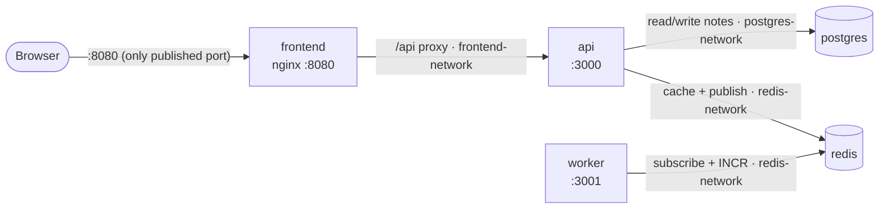

# Notes App — Dockerized Microservices

A simple notes application made of 5 containerized services. The app itself is deliberately minimal; the focus of this project is the container infrastructure: multi-stage builds, non-root images, network isolation, healthchecks, a registry-based production deployment, and vulnerability scanning.

## Services

| Service | Tech | Port | Responsibility |
|---|---|---|---|
| frontend | Vite + nginx-unprivileged | 8080 | Serves the static HTML/CSS/JS to the browser and reverse-proxies `/api` requests to the api service |
| api | Node.js + Express | 3000 | Creates, reads and deletes notes in Postgres; caches the notes list in Redis; publishes a `notes:created` event on every new note |
| worker | Node.js (built-in `http`) | 3001 | Subscribes to the `notes:created` channel and counts events in Redis; exposes the count on `/stats` |
| postgres | postgres:16-alpine3.24 | 5432 | Persistent database storing all notes |
| redis | redis:8-alpine3.22 | 6379 | Cache for the notes list (60s TTL) and pub/sub message broker between the api and the worker |

## Architecture



**Read path:** Browser → Nginx (8080) → `/api` is proxied to the api → the api checks Redis. On a cache hit it responds immediately; on a miss it queries Postgres, stores the result in Redis, then responds.

**Create path:** The api writes the note to Postgres, deletes the cached list (so the next read is fresh), and publishes a `notes:created` event to Redis. The worker, subscribed to that channel, increments the counter `stats:notes_created` in Redis.

## Network Isolation

| Network | Members | Internal | Purpose |
|---|---|---|---|
| frontend-network | frontend, api | No | Nginx → api traffic. Must be non-internal because port 8080 is published to the host |
| postgres-network | api, postgres | Yes | Only the api needs the database |
| redis-network | api, worker, redis | Yes | Cache access and pub/sub between the api and the worker |
| dev-network (override only) | worker | No | Dev mode only: internal networks ignore published ports, so this network lets the worker's port 3001 and debug port be reached from the host |

The api is the only service on more than one network because it is the only service that needs to talk to the frontend, Postgres and Redis. Postgres and Redis sit on `internal: true` networks: containers on them have no route to or from the outside world, and published ports don't work on them. Even if a port mapping were added by mistake, the databases stay unreachable from the host.

## Prerequisites

- Docker Engine with Compose v2 (Docker Desktop on Windows/macOS includes both)
- Git
- Trivy (optional, for the vulnerability scans)

## Quick Start

```bash
git clone https://github.com/Jason2303/Docker-NotesApp.git notes-app && cd notes-app
cp .env.example .env          # then edit the placeholder values
docker compose up -d --build
```

Open `http://localhost:8080`.

## Development Mode

`docker compose up` automatically loads `docker-compose.override.yml` on top of `docker-compose.yml`. Compose merges the two files: single values (like `command`) are replaced, lists (like `ports`) are appended, and maps (like `environment`) are merged by key. This turns the production-style base file into a development setup without editing it.

| Feature | Detail |
|---|---|
| App ports | api `3000:3000`, worker `3001:3001` published for direct testing |
| Debug ports | api `9229:9229`, worker `9230:9229` (Node inspector) |
| Bind mounts | `./services/api:/app` and `./services/worker:/app`, plus an anonymous volume on `/app/node_modules` so the image's installed modules aren't hidden by the mount |
| NODE_ENV | `development` |
| Auto-restart | `node --watch` restarts on file changes. **Windows limitation:** file-change events don't cross from Windows into the container on bind mounts, so use `docker compose restart <service>` (or clone the repo inside WSL2) |

## Production Mode

Production uses pre-built images from Docker Hub; nothing is built locally.

```bash
docker compose -f docker-compose.prod.yml up -d
docker compose -f docker-compose.prod.yml ps
```

Passing `-f` tells Compose to load **only** that file, so neither the base file nor the dev override is applied. Images are pinned to version tags rather than `latest` because `latest` moves on every push; a version tag guarantees production runs exactly the image that was tested. Version tags are treated as immutable: a changed image gets a new tag (e.g. the frontend fix shipped as `v1.0.1`), never an overwrite.

> The postgres service still bind-mounts `./database/init.sql`, so the repo (or at least that file) and a `.env` are required on the production host.

**First production run, pulling from Docker Hub (no build):**


**All 5 services running and healthy:**


## Pulling from Docker Hub

Images are published under [hub.docker.com/u/atlas201](https://hub.docker.com/u/atlas201).

```bash
docker pull atlas201/notes-api:v1.0.0
docker pull atlas201/notes-worker:v1.0.0
docker pull atlas201/notes-frontend:v1.0.1
```

| Repository | Tags | Notes |
|---|---|---|
| atlas201/notes-api | `v1.0.0`, `latest` | |
| atlas201/notes-worker | `v1.0.0`, `latest` | |
| atlas201/notes-frontend | `v1.0.0`, `v1.0.1`, `latest` | `v1.0.1` adds an explicit `USER 101` (Trivy fix); `latest` = `v1.0.1` |

## Environment Variables

All configuration is read from `.env` at runtime. `.env` is gitignored and dockerignored; `.env.example` (placeholders only) is committed.

| Variable | Used by | Example | Secret? |
|---|---|---|---|
| FRONTEND_PORT | Compose (host port mapping) | `8080` | No |
| API_PORT | api | `3000` | No |
| WORKER_PORT | worker | `3001` | No |
| POSTGRES_HOST | api | `postgres` | No |
| POSTGRES_PORT | api | `5432` | No |
| POSTGRES_DB | api, postgres | `notes` | No |
| POSTGRES_USER | api, postgres | `notes` | No |
| POSTGRES_PASSWORD | api, postgres | `changeme` | **Yes** |
| REDIS_HOST | api, worker | `redis` | No |
| REDIS_PORT | api, worker | `6379` | No |
| NODE_ENV | api, worker | `production` (set in the image; `development` via override) | No |

**Least privilege:** each service receives only the variables it needs. The worker only talks to Redis, so it gets the Redis connection details and no Postgres credentials at all.

## Image Size Report

| Image | Unpacked | Compressed (Docker Hub) |
|---|---|---|
| notes-api | ~89 MB | ~32 MB |
| notes-worker | ~84 MB | ~31 MB |
| notes-frontend | ~58 MB | ~23 MB |

The first api image, based on `node:22-alpine`, was ~191 MB. Switching the runtime stage to `alpine:3.24` with only the `nodejs` package from `apk` (no npm, no build tools) cut it to ~89 MB.

## Security Measures

- **Non-root users:** api and worker run as UID 1001 (`appuser`); the frontend runs as UID 101 (nginx-unprivileged), declared explicitly with `USER 101`
- **Unprivileged ports:** all services listen on ports above 1024, so no root is needed to bind them
- **Multi-stage builds:** npm and build tools stay in the builder stage; only the app code, production `node_modules` and the runtime reach the final image
- **Pinned base images:** `alpine:3.24`, `postgres:16-alpine3.24`, `redis:8-alpine3.22`
- **No secrets in images:** credentials are injected at runtime from `.env`, which is excluded by both `.gitignore` and `.dockerignore`
- **Least-privilege env vars:** each service only receives the variables it needs (the worker has no DB password)
- **Single entry point:** only port 8080 is published to the host; the api, worker and databases are not reachable from outside
- **Internal networks:** the Postgres and Redis networks are `internal: true`
- **Resource limits:** CPU and memory limits on every service in Compose

## Vulnerability Scanning (Trivy)

| Target | HIGH | CRITICAL | Notes |
|---|---|---|---|
| `trivy config .` | – | – | 1 finding (missing `USER` in the frontend Dockerfile) → fixed in v1.0.1 → 0 |
| notes-api:v1.0.0 | 0 | 0 | |
| notes-worker:v1.0.0 | 0 | 0 | |
| notes-frontend:v1.0.1 | 1 | 0 | `libexpat` (CVE-2026-93990) from the nginx base image. Fixed upstream in 2.8.5-r0; remediate by rebuilding with `docker compose build --pull frontend` once the base image is updated |
| postgres:16-alpine3.24 | 21 | 1 | Alpine packages clean. All findings are in the bundled `gosu` binary's Go standard library (TLS/HTTP/URL parsing code). `gosu` only switches user at startup and never uses the network, so these paths aren't reachable. Upstream-owned |
| redis:8-alpine3.22 | 0 | 0 | |

**All three project images have zero CRITICAL vulnerabilities.**

Commands used:

```bash
trivy config .
trivy image --severity HIGH,CRITICAL atlas201/notes-api:v1.0.0
trivy image --scanners vuln --severity HIGH,CRITICAL postgres:16-alpine3.24
```

<details>
<summary>Scan screenshots</summary>

**Config scan (after fix)**


**api**


**worker**


**frontend**


**postgres**


**redis**


</details>

## Healthchecks & Startup Order

| Endpoint | Meaning |
|---|---|
| `/health` | Liveness: the process is running and can answer HTTP. Used by the Dockerfile `HEALTHCHECK` |
| `/ready` | Readiness: the service's dependencies (Postgres/Redis) are connected and it can do real work |

Healthchecks call `http://127.0.0.1:<port>/health` rather than `localhost` (see Issues below). Postgres uses `pg_isready` and Redis uses `redis-cli ping`.

Startup order uses `depends_on` with `condition: service_healthy`: Postgres and Redis must be healthy before the api starts; Redis must be healthy before the worker starts; the api must be healthy before the frontend starts. Each service waits only for what it actually needs.

## Bonus Features

- **Nginx single entry point:** the frontend's Nginx serves the static files and reverse-proxies `/api` to `api:3000`. The browser only ever talks to port 8080, the frontend uses relative `/api` paths, and no CORS configuration is needed.
- **Graceful shutdown:** both Node services handle `SIGTERM` by closing the HTTP server and the Redis/Postgres connections before exiting. Because `CMD` uses exec form (`["node", "server.js"]`), Node runs as PID 1 and receives the signal directly; the containers stop in ~2–3 s instead of being force-killed after the 10 s timeout.

  

- **CI pipeline:** `.github/workflows/docker-publish.yml` (GitHub Actions) builds and pushes all three images on every push to `main` and on every `v*` git tag. A matrix runs the three services in parallel. Tags: git tag pushes publish that version (e.g. `v1.1.0`); pushes to `main` publish `latest` plus a `sha-<commit>` tag for traceability. BuildKit layer caching is stored in the GitHub Actions cache per service. Docker Hub credentials come from repository secrets (`DOCKERHUB_USERNAME`, `DOCKERHUB_TOKEN`), never from the repo.

  

## Issues Encountered & Fixes

| Problem | Cause | Fix |
|---|---|---|
| `npm ci` failed | No `package-lock.json`; `npm ci` requires one | Generated and committed lockfiles for all three services |
| Image too large (~191 MB) | `node:22-alpine` ships npm, yarn and extra tooling; deleting files in a later layer doesn't shrink earlier layers | Runtime stage on `alpine:3.24` + `apk add nodejs` only (~89 MB) |
| `chown -R` duplicated `node_modules` | `chown` after `COPY` rewrites every file into a new layer | Create the user first, then `COPY --chown` |
| Healthchecks failing | BusyBox `wget` resolved `localhost` to IPv6 `::1`; the apps listen on IPv4 `0.0.0.0` | Healthchecks use `127.0.0.1` |
| Image pulls failing (`no such host`) | Docker Desktop's internal DNS broke while Windows DNS worked | Quit Docker Desktop + `wsl --shutdown`, then restart |
| Worker dev ports not reachable | Published ports are ignored on `internal: true` networks | Dev-only `dev-network` added in the override |
| Hot reload not firing on Windows | File-change events don't propagate across Windows bind mounts | `docker compose restart <service>`, or clone inside WSL2 |
| Worker counter reset on restart | Counter was stored in process memory | Counter moved into Redis (`INCR`); survives restarts and works across replicas |
| Docker Hub `insufficient_scope` | Images tagged with the wrong username | Re-tagged as `atlas201/...` |
| Push failing (`broken pipe`) | Unstable connection dropped the largest layer mid-upload | Re-ran the push (finished layers are skipped); set `max-concurrent-uploads: 1` in the Docker daemon config |
| Trivy: missing USER in frontend | Base image already runs as UID 101, but Trivy only reads the Dockerfile text | Added explicit `USER 101`; released as a new tag `v1.0.1` instead of overwriting `v1.0.0` |

## Known Limitations

- No frontend hot reload in dev mode (would need a separate Vite dev-server stage)
- The `nginx-unprivileged:stable-alpine3.24` tag floats; it isn't pinned to a specific Nginx version or digest
- Production still depends on the `init.sql` bind mount (to be baked into a custom Postgres image in the capstone)
- One HIGH (`libexpat`) in the frontend base image, pending an upstream rebuild
- Redis image is on Alpine 3.22 (currently scans clean)
